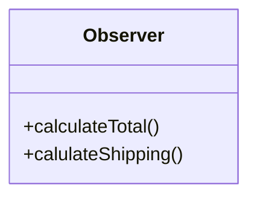

## Pattern type

This is a behavioural pattern that allows a one-to-many relationship between objects so that when the state of one object changes all its children objects are notified and updated automatically.

## Intent

The pattern intent is to make it easier to maintain consistency between related objects without making them tightly coupled.

## Problem

...

## Pattern



## Code example

````python
class Subject:
    def __init__(self):
        pass

```python
class Observer:
    def __init__(self):
        pass
````

```python
...
```

prints out:

```text
...
```
