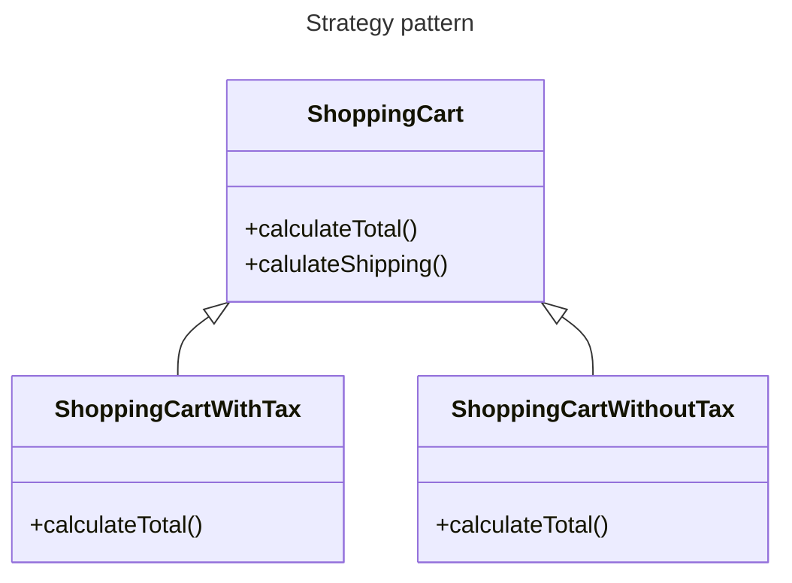

## Pattern type

This is a behavioural pattern, it allows algorithms to be selected on-the-fly at runtime

## Intent

This pattern allows the client to choose from a family of algorithms and gives a simple way to switch between the different algorithms.

## Problem

You may have a class that has a method that performs a specific task, but you want to be able to change the way the task is performed without changing the class.

As an example imagine you have a class that has a method that calculates the total cost of a shopping cart.
You may want to be able to change the way the total is calculated, for example, you may want to calculate the total with or without tax.

