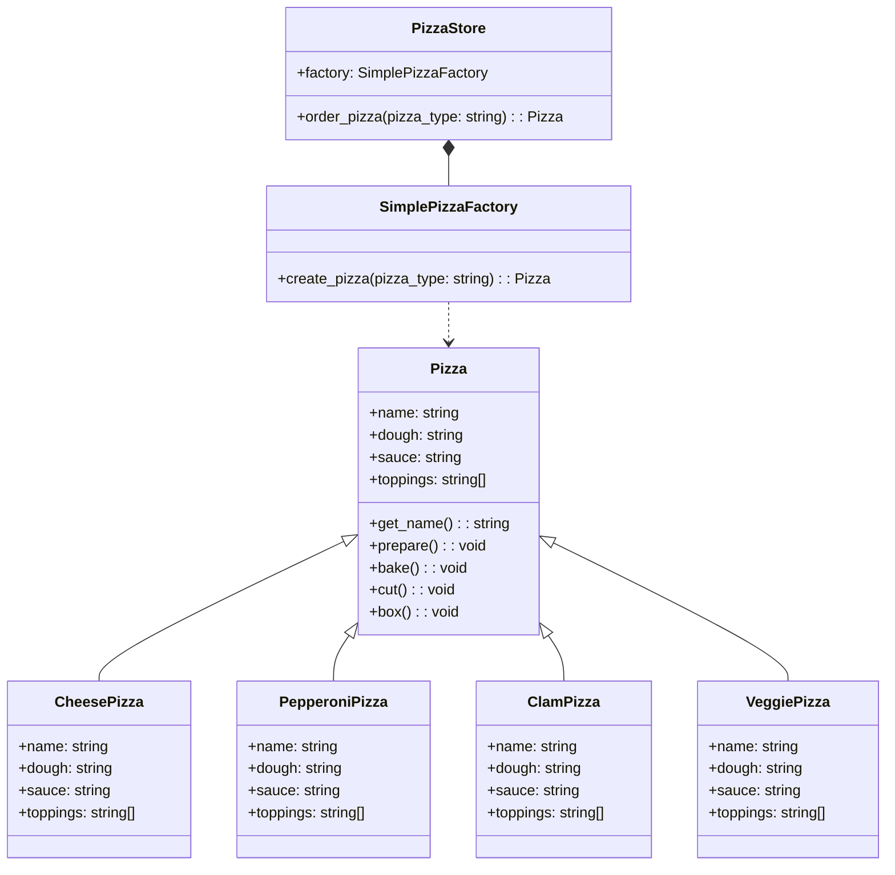

## Pattern type

Creational pattern

## Intent

The abstract factory pattern provides an interface for creating families of related or dependent objects without specifying their concrete classes.

## Problem

You want to create a family of related or dependent objects, but you don't want to specify their concrete classes.

## Pattern

The abstract factory pattern provides an interface for creating families of related or dependent objects without specifying their concrete classes. The abstract factory pattern defines an interface for creating a family of related objects, but lets subclasses decide which class to instantiate.



- list here

## Code example

```python
from abc import ABC, abstractmethod

class Pizza(ABC):
    def __init__(self):
        self.name = None
        self.dough = None
        self.sauce = None
        self.toppings = []

    def get_name(self):
        return self.name

    def prepare(self):
        print("Preparing " + self.name)
        print("Tossing dough...")
        print("Adding sauce...")
        print("Adding toppings: " + ", ".join(self.toppings))

    def bake(self):
        print("Baking " + self.name)

    def cut(self):
        print("Cutting " + self.name)

    def box(self):
        print("Boxing " + self.name)

```

## Resources

- [Head First Design Patterns](https://www.oreilly.com/library/view/head-first-design/0596007124/)
- [Design Patterns: Elements of Reusable Object-Oriented Software](https://www.oreilly.com/library/view/design-patterns-elements/0201633612/)
- [Refactoring Guru](https://refactoring.guru/design-patterns/observer)
