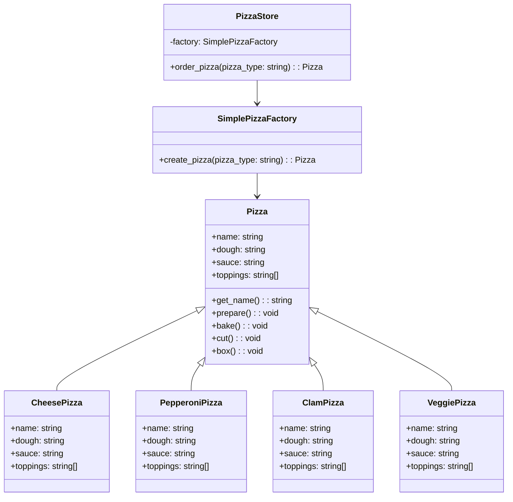

## Pattern type

Creational pattern

## Intent

The factory pattern is a creational pattern that provides an interface for creating objects in a superclass, but allows subclasses to alter the type of objects that will be created.

## Problem

You know the type of object you want to create, but you want to delegate the creation of the object to subclasses.

## Pattern

The factory method pattern defines an interface for creating objects, but lets subclasses alter the type of objects that will be created. The factory method lets a class defer instantiation to subclasses.



- list here

## Code example

```python
from abc import ABC, abstractmethod

class Pizza(ABC):
    def __init__(self):
        self.name = None
        self.dough = None
        self.sauce = None
        self.toppings = []

    def get_name(self):
        return self.name

    def prepare(self):
        print("Preparing " + self.name)
        print("Tossing dough...")
        print("Adding sauce...")
        print("Adding toppings: " + ", ".join(self.toppings))

    def bake(self):
        print("Baking " + self.name)

    def cut(self):
        print("Cutting " + self.name)

    def box(self):
        print("Boxing " + self.name)


class CheesePizza(Pizza):
    def __init__(self):
        self.name = "Cheese Pizza"
        self.dough = "Regular Crust"
        self.sauce = "Marinara Pizza Sauce"
        self.toppings = []
        self.toppings.append("Fresh Mozzarella")
        self.toppings.append("Parmesan")


class PepperoniPizza(Pizza):
    def __init__(self):
        self.name = "Pepperoni Pizza"
        self.dough = "Crust"
        self.sauce = "Marinara sauce"
        self.toppings = []
        self.toppings.append("Sliced Pepperoni")
        self.toppings.append("Sliced Onion")
        self.toppings.append("Grated parmesan cheese")

class ClamPizza(Pizza):
    def __init__(self):
        self.name = "Clam Pizza"
        self.dough = "Regular crust"
        self.sauce = "Tomato sauce"
        self.toppings = []
        self.toppings.append("Fresh clams")
        self.toppings.append("Garlic")
        self.toppings.append("Grated parmesan cheese")

class VeggiePizza(Pizza):
    def __init__(self):
        self.name = "Veggie Pizza"
        self.dough = "Crust"
        self.sauce = "Marinara sauce"
        self.toppings = []
        self.toppings.append("Shredded mozzarella")
        self.toppings.append("Grated parmesan")
        self.toppings.append("Diced onion")
        self.toppings.append("Sliced mushrooms")

class PizzaStore:
    def __init__(self, factory):
        self.factory = factory

    @abstractmethod
    def order_pizza(self, pizza_type: str):
        pizza = self.factory.create_pizza(pizza_type)

        pizza.prepare()
        pizza.bake()
        pizza.cut()
        pizza.box()

        return pizza

class SimplePizzaFactory:
    def create_pizza(self, pizza_type: str):
        pizza = None

        if pizza_type == 'cheese':
            pizza = CheesePizza()
        elif pizza_type == 'pepperoni':
            pizza = PepperoniPizza()
        elif pizza_type == 'pepperoni':
            pizza = PepperoniPizza()
        elif pizza_type == 'clam':
            pizza = ClamPizza()
        elif pizza_type == 'veggie':
            pizza = VeggiePizza()
        else:
            raise ValueError(f'Invalid pizza type: {pizza_type}')

        return pizza


factory = SimplePizzaFactory()
store = PizzaStore(factory)

pizza = store.order_pizza('cheese')
print(f"Ordered a {pizza.get_name()}\n")

pizza = store.order_pizza('pepperoni')
print(f"Ordered a {pizza.get_name()}\n")

pizza = store.order_pizza('clam')
print(f"Ordered a {pizza.get_name()}\n")

pizza = store.order_pizza('veggie')
print(f"Ordered a {pizza.get_name()}\n")
```

## Resources

- [Head First Design Patterns](https://www.oreilly.com/library/view/head-first-design/0596007124/)
- [Design Patterns: Elements of Reusable Object-Oriented Software](https://www.oreilly.com/library/view/design-patterns-elements/0201633612/)
- [Refactoring Guru](https://refactoring.guru/design-patterns/observer)
