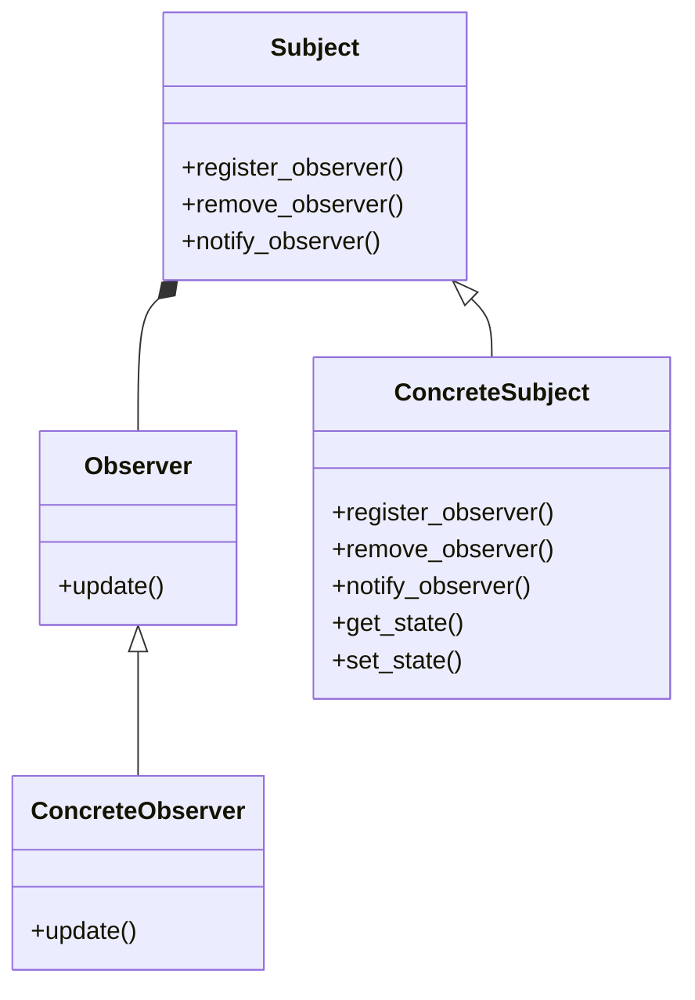

## Pattern type

This is a behavioural pattern.

## Intent

A one-to-many relationship between objects is created so that when the state of one object changes all its children objects are notified and updated automatically.

The pattern intent is to make it easier to maintain consistency between related objects without making them tightly coupled.

## Problem

You have many clients that need to be updated when the state of of object changes.

## Pattern



- the `Subject` class is the object that is being observed
- the `Observer` class is the object that is observing the `Subject`
- the `ConcreteSubject` implements the `Subject` interface
- the `ConcreteObserver` can be any class that implements the `Observer` interface

## Code example

Consider this psuedo code example:

```python
class Subject:
    def __init__(self):
        pass

    def register_observer(self, observer):
        pass

    def remove_observer(self, observer):
        pass

    def notify_observers(self):
        pass


class Observer:
    def __init__(self):
        pass

    def update(self):
        pass


class ConcreteSubject:
    def __init__(self):
        pass

    def register_observer(self, observer):
        # add observer to list of observers
        pass

    def remove_observer(self, observer):
        # remove observer from list of observers
        pass

    def notify_observers(self):
        # notify all observers
        pass

    def get_state(self):
        # get state of subject
        pass

    def set_state(self, state):
        # set state of subject
        pass

class ConcreteObserver:
    def __init__(self):
        pass

    def update(self):
        # update observer
        pass

    # any other methods
```

## Resources

- [Head First Design Patterns](https://www.oreilly.com/library/view/head-first-design/0596007124/)
- [Design Patterns: Elements of Reusable Object-Oriented Software](https://www.oreilly.com/library/view/design-patterns-elements/0201633612/)
- [Refactoring Guru](https://refactoring.guru/design-patterns/observer)
